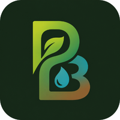

<p align="center">
  
</p>

<h1 align="center">PermaDesigner</h1>

<p align="center">
  <strong>Seu companheiro inteligente de design em permacultura.</strong><br/>
  Da observação do terreno ao documento de escopo — guiado por IA, fundamentado nos 12 princípios.
</p>

<p align="center">
  
  
  
  
</p>

<p align="center">
  
  
  
</p>

---

## 🌱 O que é

**PermaDesigner** transforma o processo de design em permacultura em uma conversa inteligente.

Você responde perguntas guiadas — sobre seus objetivos, seu terreno, os padrões da natureza que observa, suas fronteiras e recursos — e o app organiza tudo em um **documento de escopo de design** profissional, pronto para apresentar a clientes, financiadores ou comunidades.

> *"Nenhuma informação factual é inventada. Tudo que o assistente afirma sobre frameworks, princípios ou ODS vem de uma base de conhecimento verificada — nunca da memória livre da IA."*

---

## ✨ Como funciona

| Etapa | O que acontece |
|-------|---------------|
| 🎯 **Objetivos** | Articule a visão e os objetivos do seu projeto |
| 🗺️ **Levantamento** | Descreva o local: clima, área, elementos existentes |
| 🌿 **Padrões da natureza** | Observe sol, água, vento, topografia, vegetação, fauna |
| 🧱 **Fronteiras e recursos** | Mapeie limites, recursos disponíveis e restrições |
| 💡 **Decisões de design** | Tome decisões guiadas pelos 12 princípios de Holmgren |
| 🌍 **ODS** | Alinhe seu projeto aos Objetivos de Desenvolvimento Sustentável |
| 📄 **Documento** | Exporte seu escopo em PDF ou DOCX — ou receba por email |

---

## 🚀 Começar a usar

### Como webapp (recomendado)

Acesse **[permadesigner.vercel.app](https://permadesigner.vercel.app)** e entre com sua conta Google. Pronto.

### Instalar no celular (PWA)

1. Acesse o link acima no Chrome ou Edge
2. Toque em **"Adicionar à tela inicial"**
3. Use como app — funciona offline

### Rodar localmente

```bash
git clone https://github.com/catitodev/permadesigner.git
cd permadesigner
npm install
cp .env.example .env.local  # preencher com suas chaves
npm run dev
```

---

## 🛡️ Segurança e privacidade

- **Zero alucinação** — toda informação factual é validada contra a base de conhecimento antes de chegar até você
- **Seus dados são seus** — RLS (Row Level Security) em 100% das tabelas; ninguém acessa seus projetos
- **LGPD compliant** — exporte ou apague todos os seus dados a qualquer momento
- **Chaves no servidor** — nenhuma API key é exposta ao navegador
- **Offline-first** — suas mensagens são salvas localmente e sincronizadas quando a conexão voltar

---

## 🎓 Dois modos de uso

| Modo | Para quem |
|------|-----------|
| **🎓 Estudante** | Tutor empático que explica conceitos, nunca julga, sugere revisão de princípios quando relevante |
| **🛠️ Designer** | Equipe multidisciplinar que sugere competências humanas e ferramentas open-source para cada decisão |

---

## 📚 Base de conhecimento verificada

- 8 frameworks de design (SADIMET, OBREDIMET, Design Web, Dragon Dreaming, Theory U, GoSADIM, SADI/BREDIM, Cultural Emergence)
- 12 princípios de David Holmgren
- 17 ODS da ONU
- 9 categorias de leitura dos padrões da natureza
- 12 competências profissionais relevantes
- 12 ferramentas open-source reais

Todo conteúdo trilíngue (🇧🇷 🇺🇸 🇪🇸), versionado, validado por schema.

---

## 🤝 Créditos

Conteúdo factual derivado dos guias educacionais publicados pela **PermaBrasilis**:
- *Frameworks de Design em Permacultura* (PDF/PPTX)
- *ODS + 12 Princípios da Permacultura* (PDF)

---

## 📄 Licença

<a href="https://creativecommons.org/licenses/by-sa/4.0/">
  
</a>

Livre para usar, adaptar e compartilhar — com atribuição e mesma licença.
